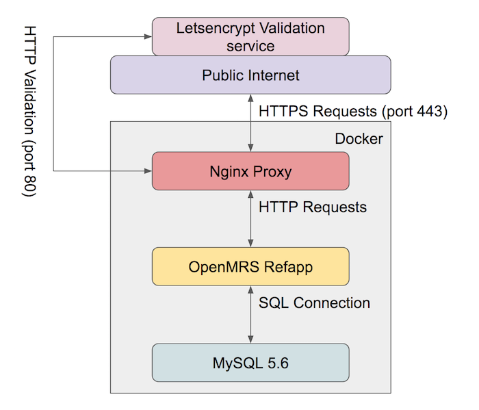

# Fortitudo OpenMRS Infrastructure

[](https://travis-ci.org/fortitudoinc/fortitudoinc-infra)

This repo contains the Fortitudo OpenMRS docker deployment

## Overview

The software stack consists of three docker containers: an nginx TLS proxy (with TLS certificates managed by letsencypt), a tomcat server with OpenMRS reference application installed, and a MySLQ 5.6 database backend.



## Requirements
- docker
- docker-compose

## Usage

Testing:
```bash
cd fortitudoinc-infra
source example.env
docker-compose up
```
